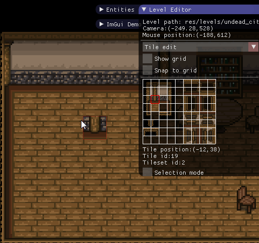
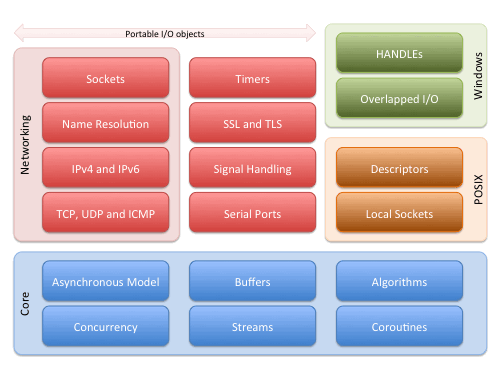
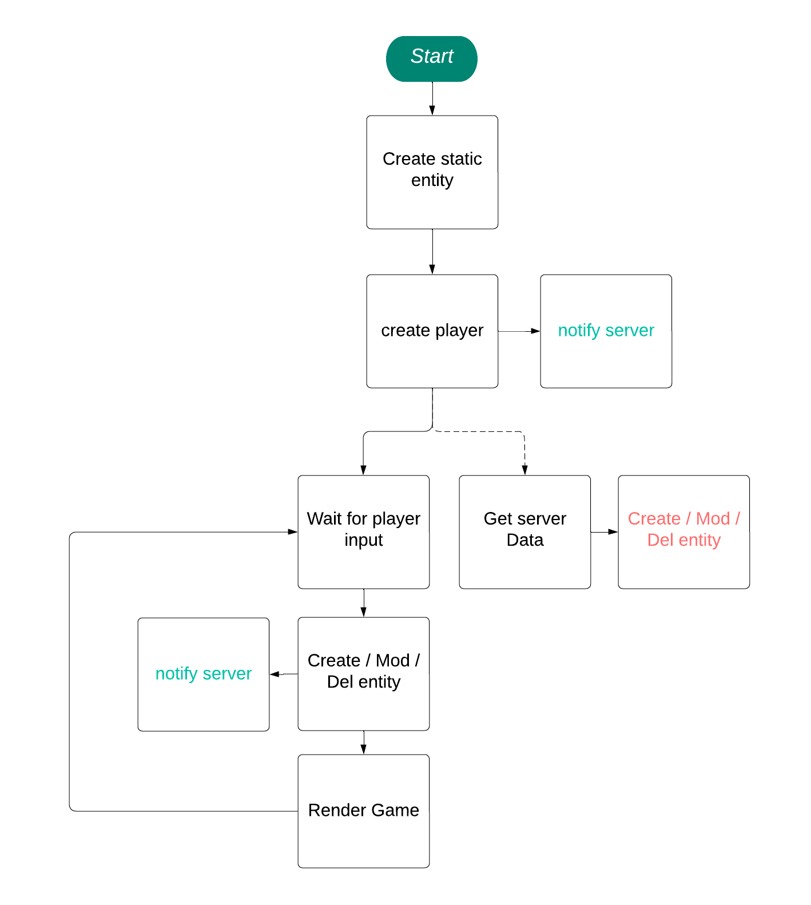
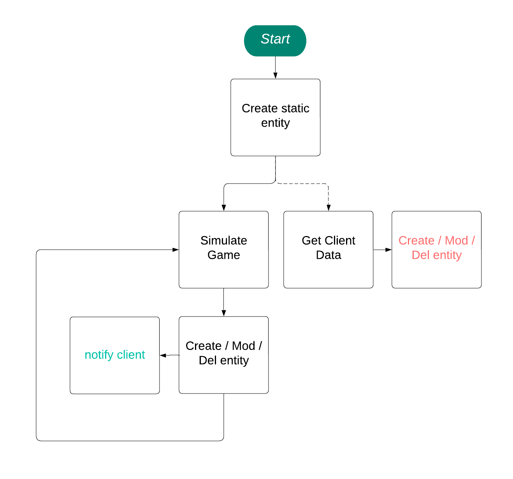
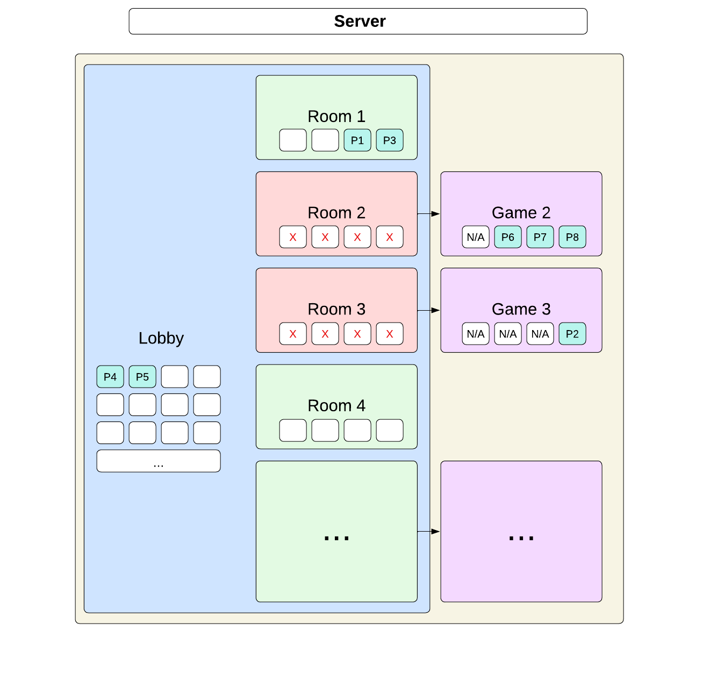
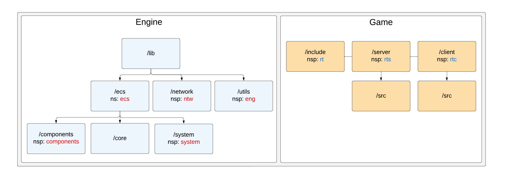

# Technical and Comparative Study

## Introduction

This document provides a comparative study of the technologies employed in the project, focusing on programming languages, graphics libraries, algorithms, networking techniques, and more. The goal is to justify the choice of each technology based on their relevance and effectiveness in addressing the project's requirements.

## Programming Language

#### C++

Ce langage de programmation orienté objet offre un bon équilibre entre performance et abstraction. Dans le cadre de ce projet, C++ est particulièrement pertinent pour plusieurs raisons:

1. **Performance élevée** : C++ permet une gestion fine des ressources, notamment de la mémoire, ce qui est essentiel pour un jeu en temps réel où la performance est critique.

2. **Gestion de la complexité** : Grâce aux classes et à l'héritage, C++ facilite la modélisation des objets du jeu (vaisseaux, ennemis, projectiles) et la gestion de leur comportement via des abstractions claires.

3. **Bibliothèques puissantes** : Le vaste écosystème de bibliothèques C++ permet d'intégrer facilement des composants essentiels comme la gestion des graphismes, du son et du réseau, tous indispensables à ce projet.

En somme, C++ offre le contrôle et la flexibilité nécessaires pour gérer les aspects temps réel et performants d'un jeu vidéo tout en favorisant une architecture modulaire et maintenable.

#### CMake

CMake est un outil de génération de build multiplateforme qui permet de définir et de gérer le processus de compilation. Dans le cadre de ce projet, CMake est particulièrement utile pour plusieurs raisons:

1. **Portabilité** : CMake permet de configurer le projet de manière à être compilé sur différents systèmes d'exploitation (Windows et Linux) sans modifications importantes du code source.

2. **Gestion des dépendances** : CMake facilite l'intégration de bibliothèques externes (comme celles pour le rendu graphique ou la gestion du réseau) en automatisant leur détection et leur lien avec le projet.

En résumé, CMake simplifie la gestion des builds complexes et garantit que le projet peut être compilé efficacement et de manière cohérente sur toutes les plateformes visées.

## Graphics Library

#### SFML

SFML (Simple and Fast Multimedia Library) est une bibliothèque multimédia conçue pour faciliter le développement d'applications graphiques, sonores et réseau. Dans ce projet de reproduction de R-Type, SFML est particulièrement pertinente pour plusieurs raisons:

1. **Simplicité d'utilisation** : SFML offre une API intuitive et simple, permettant de se concentrer sur le développement du jeu sans être submergé par des complexités techniques, ce qui est essentiel pour un projet avec une architecture complexe.

2. **Fonctionnalités complètes** : SFML fournit un large éventail de fonctionnalités, notamment la gestion des graphiques 2D, des entrées utilisateur, des sons et des réseaux, ce qui permet d'intégrer facilement tous les aspects nécessaires à un jeu vidéo.

En résumé, SFML est un excellent choix pour ce projet, car elle permet de développer rapidement des applications multimédias tout en offrant la flexibilité nécessaire pour gérer les différentes composantes d'un jeu comme R-Type.

#### ImGui

ImGui est une bibliothèque graphique légère et immédiate, conçue pour créer des interfaces utilisateur (UI) interactives.

Dans ce projet, ImGui est particulièrement adaptée pour les raisons suivantes :

1. **Facilité d'intégration** : ImGui s'intègre facilement avec les moteurs graphiques existants et permet de créer rapidement des interfaces utilisateur sans une configuration complexe, idéal pour le développement rapide d'outils de débogage et de menus.

2. **Réactivité et simplicité** : Avec son approche de programmation "Immediate Mode", ImGui permet de créer des UI interactives et réactives sans avoir à gérer des structures complexes d'événements ou de mise en page, ce qui accélère le développement.

En somme, ImGui fournit une solution efficace et rapide pour créer des interfaces utilisateur dans le cadre d'un projet de jeu, en minimisant les efforts de développement tout en restant flexible et légère.

## Networking Techniques

- UDP ET TCP

#### Asio

Asio est une bibliothèque C++ permettant de gérer les opérations d'entrée/sortie asynchrones, notamment pour les applications réseau. Dans ce projet , Asio est particulièrement appropriée pour plusieurs raisons :

1. **Modèle asynchrone** : Asio facilite la gestion des connexions réseau et des communications en mode asynchrone, ce qui permet de maintenir la fluidité du jeu tout en traitant les données réseau, essentiel pour une expérience de jeu en temps réel.

2. **Portabilité et flexibilité** : En tant que bibliothèque multiplateforme, Asio fonctionne sur différents systèmes d'exploitation, ce qui permet de développer et de déployer le jeu sur plusieurs plateformes sans modifications majeures du code.

En résumé, Asio est un choix judicieux pour ce projet, car elle permet de gérer efficacement les communications réseau, garantissant une expérience de jeu réactive et fluide tout en offrant la portabilité nécessaire pour une large distribution.

## Algorithms & Data Structures

- design pattern
- data structure

## Storage

- **Types of Storage**:

    -

- **Persistence**:

    -

- **Reliability**:

    -

- **Storage Constraints**:

    -

## Security

- **Main Vulnerabilities**:

    -

- **Data Integrity**:

    -

- **Security Monitoring**:

    -

- **Long-Term Security**:

    -
